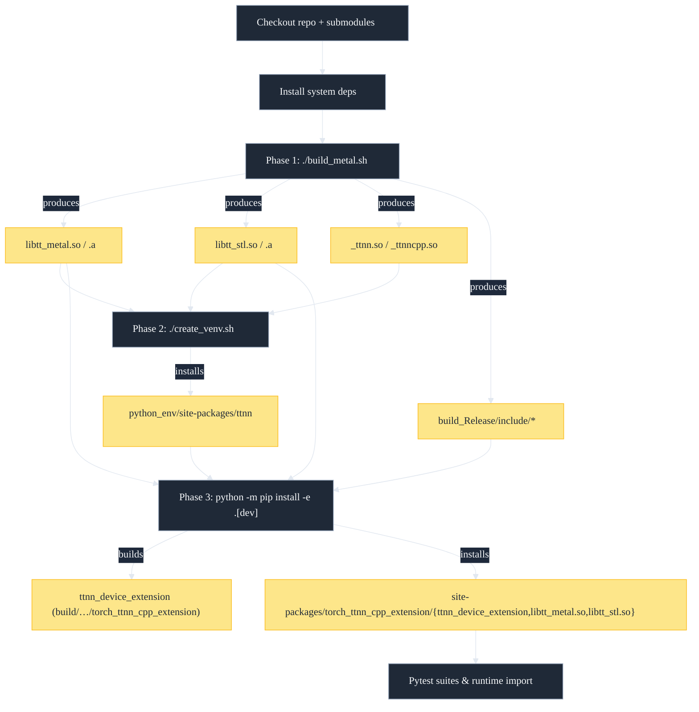
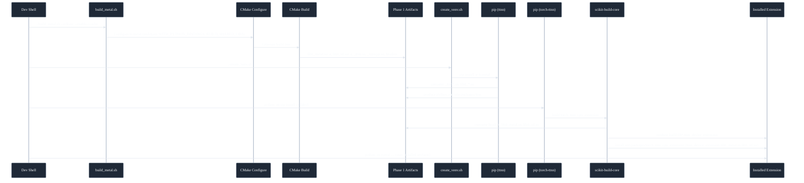
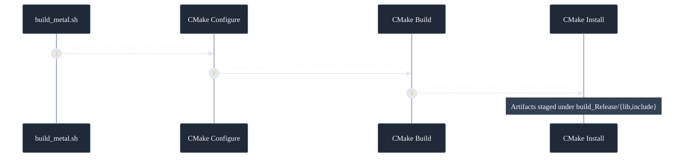
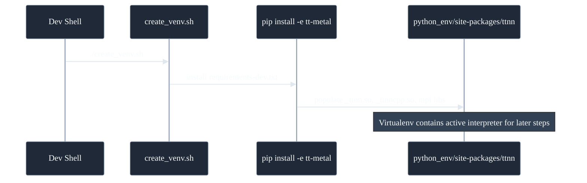
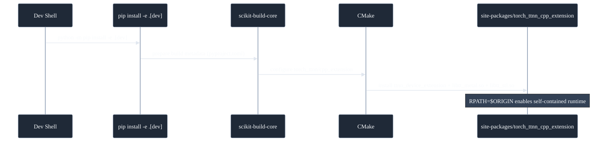

# Torch-TTNN Build Flow Reference

## Installation Quick Reference

### For Development (Building from Source)
```bash
# Phase 1: Build TT-Metal
cd torch_ttnn/cpp_extension/third-party/tt-metal
./build_metal.sh --release --enable-ccache

# Phase 2: Create virtual environment with local ttnn
./create_venv.sh
source python_env/bin/activate

# Phase 3: Install torch-ttnn (without ttnn dependency)
cd /path/to/pytorch2.0_ttnn
pip install -e .[dev]
```

### For PyPI Users (Pre-compiled)
```bash
# Simple installation with ttnn from PyPI
pip install torch-ttnn[pypi]

# Or with development tools
pip install torch-ttnn[pypi,dev]
```

## Pipeline Overview



### Artifact Sequence



### Phase 1 Process



### Phase 2 Install



### Phase 3 Install



## Components at a Glance

| Component | Location | Produced by | Notes |
| --- | --- | --- | --- |
| tt-metal | `torch_ttnn/cpp_extension/third-party/tt-metal` | `./build_metal.sh` | CMake project that builds Tenstorrent runtime libraries, TTNN C++ sources and Python bindings. |
| ttnn (Python package) | `torch_ttnn/cpp_extension/third-party/tt-metal/python_env/lib/python*/site-packages/ttnn` | `./create_venv.sh` (`pip install -e .`) | Provides `_ttnn.so`, `_ttnncpp.so`, and MPI-enabled runtime libraries. |
| torch-ttnn | repository root | `python -m pip install -e .[dev]` | Python front-end and tooling defined in `pyproject.toml` (build backend `scikit_build_core`). |
| torch_ttnn_cpp_extension | `torch_ttnn/cpp_extension` | CMake via scikit-build-core | Builds and installs `ttnn_device_extension` and bundles tt-metal shared libraries next to it. |

## Step-by-step Build Flow

### 0. Prerequisites

- Update submodules: `git submodule update --init --recursive`.
- Install host dependencies: `clang-17`, `cmake>=3.23`, `ninja`, `python>=3.10`, `pip`, `ccache`. The tt-metal script `install_dependencies.sh` can provision Ubuntu packages.
- Optional: set `PYTHON_ENV_DIR` or `PYTHON_CMD` to steer the virtual environment location and interpreter.

**Note**: `TT_METAL_HOME` environment variable is **deprecated and actively IGNORED**. If set, CMake will display a warning and unset it to prevent build conflicts. TT-Metal is always auto-detected from the submodule at `torch_ttnn/cpp_extension/third-party/tt-metal`.

### 1. Build tt-metal sources

1. `cd torch_ttnn/cpp_extension/third-party/tt-metal`
2. (Optional) `./install_dependencies.sh` to prepare system tooling.
3. `./build_metal.sh --release --enable-ccache`
   - The script builds TT-Metal and stages all artifacts in standard output directories.
   - Toolchain selection prefers `cmake/x86_64-linux-clang-17-*.cmake`; falls back to `cmake/x86_64-linux-torch-toolchain.cmake` which prefers clang-17 when available.
   - CMake package configuration files (TT-MetaliumConfig.cmake, TT-NNConfig.cmake) are auto-generated.
   - `VERSION_NUMERIC` is inferred from the checked-out tag (default from main branch) and recorded for downstream consumers.

**Key outputs**

- `libtt_metal.so` / `libtt_metal.a` (in `build_Release/lib/`)
- `libtt_stl.so` / `libtt_stl.a` (same location)
- `_ttnn.so`, `_ttnncpp.so` (same location)
- public headers under `build_Release/include/`
- CMake package configs at `build_Release/lib/cmake/`

### 2. Provision the tt-metal virtual environment

1. Staying inside `torch_ttnn/cpp_extension/third-party/tt-metal`, run `./create_venv.sh`.
   - Honors `PYTHON_CMD` and `PYTHON_ENV_DIR`; default venv path is `python_env/`.
   - On Ubuntu 22.04 the script pins pip/setuptools versions and configures the PyTorch CPU wheel index.
   - Installs tt-metal dev requirements and registers the `ttnn` package via `pip install -e .`.
2. The resulting environment contains:
   - `python_env/bin/` with the interpreter used for all subsequent steps.
   - `python_env/lib/python*/site-packages/ttnn/` with `_ttnn.so`, `_ttnncpp.so`, MPI shared libraries, and Python sources.
   - Pre-commit hooks (unless the repository is checked out as a worktree).

### 3. Install torch-ttnn and build the C++ extension

1. `source torch_ttnn/cpp_extension/third-party/tt-metal/python_env/bin/activate` (or use the chosen `PYTHON_ENV_DIR`).
2. Ensure build tooling is up to date: `python -m pip install --upgrade pip scikit-build-core cmake ninja`.
3. Install the project: `python -m pip install -e .[dev]`
   - For **development builds**, use the `[dev]` extra which excludes `ttnn` (already installed in Phase 2)
   - For **PyPI testing**, use `[pypi,dev]` to pull ttnn from PyPI
   - `pyproject.toml` declares `scikit_build_core.build` as the backend; the wheel exposes the `torch_ttnn` package.
   - scikit-build-core drives CMake in `torch_ttnn/cpp_extension` following CMake best practices:
     - **Clean dependency resolution**: Uses standard `find_package(TT-Metalium)` and `find_package(TT-NN)` to locate pre-built TT-Metal artifacts from Phase 1.
     - **Auto-detection**: TT-Metal is automatically discovered from the submodule at `third-party/tt-metal` - no environment variables needed.
     - **Proper imported targets**: Links against `TT::Metalium`, `TTNN::CPP`, and `Python::Module` imported targets.
     - **Automatic ABI detection**: Detects PyTorch's C++ ABI compatibility flags automatically.
     - Toolchain discovery prefers `third-party/tt-metal/cmake/x86_64-linux-clang-17-*.cmake`, falling back to `cmake/x86_64-linux-torch-toolchain.cmake`.
   - The `ttnn_device_extension` module is compiled with `CXX_STANDARD 20` and no filename suffix.
   - **Self-contained installation**: Uses `install(IMPORTED_RUNTIME_ARTIFACTS)` to bundle TT-Metal shared libraries alongside the extension.
   - **Runtime resolution**: Both build and install RPATHs are set to `$ORIGIN` for self-contained operation.
   - **IDE integration**: `CMAKE_EXPORT_COMPILE_COMMANDS=ON` generates `compile_commands.json` for clangd and other IDEs.
4. Editable installs keep a live `.pth` file and expose the CMake build tree under `torch_ttnn/cpp_extension/build/`.

### 4. Run native tests / use the extension

**Quickest way**: Use the provided test script which handles all environment setup:

```bash
./scripts/run-cpp-tests.sh
```

**Manual setup** (if you prefer to run pytest directly):

```bash
# Activate venv
source torch_ttnn/cpp_extension/third-party/tt-metal/python_env/bin/activate

# Run tests directly - no LD_LIBRARY_PATH needed!
python -m pytest tests/cpp_extension/test_cpp_extension_functionality.py -v
python -m pytest tests/cpp_extension/test_bert_cpp_extension.py -v
python -m pytest tests/models --native_integration -v
```

**Why LD_LIBRARY_PATH is no longer needed**: 
- The C++ extension's RPATH is now configured to include PyTorch's library directory automatically
- `BUILD_RPATH` and `INSTALL_RPATH` are set to `$ORIGIN:${PYTORCH_LIB_DIR}` during CMake configuration
- This allows the dynamic linker to find both bundled tt-metal libraries and PyTorch's C++ libraries at runtime
- The RPATH configuration is detected automatically from your Python environment during build

**If you encounter "undefined symbol" errors**:
- Rebuild the extension: `python -m pip install -e . --no-build-isolation --force-reinstall`
- Verify RPATH is set correctly: `readelf -d $(python -c 'from torch_ttnn.cpp_extension import ttnn_device_extension as m; print(m.__file__)') | grep RPATH`
- As a temporary workaround, you can manually set `LD_LIBRARY_PATH` (but this indicates a build configuration issue)

## Artifact & Dependency Map

| Stage | Command | Outputs (location) | Consumed by |
| --- | --- | --- | --- |
| tt-metal build | `./build_metal.sh --release --enable-ccache` | `build_Release/lib/` → `libtt_metal.*`, `libtt_stl.*`, `_ttnn*.so`; `build_Release/include/`; `build_Release/lib/cmake/` → package configs | `create_venv.sh`, C++ extension via `find_package()` |
| Python env provisioning | `./create_venv.sh` | `python_env/` with Python interpreter, `site-packages/ttnn/`, MPI libs | `python -m pip install -e .[dev]`, runtime imports |
| torch-ttnn install | `python -m pip install -e .[dev]` | `site-packages/torch_ttnn/`; `site-packages/torch_ttnn_cpp_extension/ttnn_device_extension` + bundled `libtt_metal.so`, `libtt_stl.so`; editable `.pth` | Users, tests, downstream tooling |
| CMake build tree | (internal to scikit-build-core) | `torch_ttnn/cpp_extension/build/lib.*/torch_ttnn_cpp_extension/` | Debugging, incremental rebuilds |

## Development vs PyPI Distribution

This project supports two distinct usage patterns with different build requirements:

### Development Builds (Building from Source)

**Target users**: Contributors, developers working on torch-ttnn

**Build process**:
1. Manual 3-phase build:
   - Phase 1: `cd torch_ttnn/cpp_extension/third-party/tt-metal && ./build_metal.sh --release --enable-ccache`
   - Phase 2: `cd torch_ttnn/cpp_extension/third-party/tt-metal && ./create_venv.sh`
   - Phase 3: `python -m pip install -e .[dev]`
2. Extension links against local tt-metal build artifacts in `build_Release/` (auto-detected from submodule)
3. The `ttnn` Python package is installed via `create_venv.sh` (not from PyPI)

**Runtime requirements**:
- No `LD_LIBRARY_PATH` required (RPATH includes PyTorch lib directory automatically)
- Extension finds dependencies via `$ORIGIN` RPATH and PyTorch's lib directory
- All shared libraries resolved at runtime without environment variables

**Dependencies**:
- tt-metal source code (git submodule)
- Build toolchain (clang-17, cmake, ninja, ccache)
- Python development headers

### PyPI Distribution (Binary Wheels)

**Target users**: End users, ML engineers using torch-ttnn in production

**Installation**:
```bash
# Standard installation (includes ttnn from PyPI)
pip install torch-ttnn[pypi]

# Or with all extras
pip install torch-ttnn[pypi,dev]
```

**What's included in the wheel**:
- Pre-compiled `ttnn_device_extension.so`
- Bundled tt-metal runtime libraries (`libtt_metal.so`, `libtt_stl.so`)
- Self-contained via `$ORIGIN` RPATH (no environment setup needed)

**Runtime requirements**:
- PyTorch installed (automatic dependency via pip)
- `ttnn` Python package installed (automatic dependency via pip, version pinned in `pyproject.toml`)
- No build tools required
- No `LD_LIBRARY_PATH` or other environment variables needed

**Key differences from dev builds**:
- `ttnn` package comes from PyPI (not built locally)
- tt-metal libraries are bundled in the wheel (not from `${TT_METAL_HOME}`)
- No compilation happens on user's machine
- Smaller, focused dependency set (no build tools)

### Dependency Strategy: `ttnn` Package

The `ttnn` Python package (TT-Metal's Python bindings) is handled differently in each scenario:

**Development builds**:
- Installed manually via `torch_ttnn/cpp_extension/third-party/tt-metal/create_venv.sh`
- Uses `pip install -e .` pointing to local tt-metal checkout (the submodule)
- Gives developers control over tt-metal version
- **Key insight**: `ttnn` is in the `[pypi]` optional extra, NOT in base dependencies
- When you install with `pip install -e .[dev]`, ttnn is NOT installed/replaced
- This uses Python packaging best practices (optional dependency groups)

**PyPI installations**:
- Users install with: `pip install torch-ttnn[pypi]` (includes ttnn from PyPI)
- ttnn specified in `[project.optional-dependencies.pypi]` as direct URL reference
- Automatically updated by `.github/workflows/update-ttnn-wheel.yaml`
- Downloaded from internal PyPI like any other Python package
- Users don't need to know about tt-metal at all

This dual-mode approach uses **Python packaging standards** (optional dependency groups) to handle the different ttnn sources, allowing developers to work with bleeding-edge tt-metal while providing stable, versioned releases for end users.

## Configuration Knobs

### Build-Time Variables

- `TT_METAL_VERSION`: overrides the version recorded in the extension metadata; defaults to the git tag discovered from the submodule.
- `PYTHON_CMD`, `PYTHON_ENV_DIR`: control the interpreter used by `create_venv.sh` and where the virtual environment is created.
- `CMAKE_ARGS`: passed by scikit-build-core to `cmake`. Example: `CMAKE_ARGS="-DCMAKE_BUILD_TYPE=Debug -DTTNN_BUILD_EXAMPLES=ON" python -m pip install -e .`.
  - Build tooling now injects `-DCMAKE_EXPORT_COMPILE_COMMANDS=ON` automatically; override by setting `CMAKE_ARGS` yourself if needed.
- `OUTPUT_NAME`: allows renaming the generated module (`OUTPUT_NAME=my_extension python -m pip install -e .`).
- `TORCH_ABI_FLAGS`: export to force a specific ABI flag instead of autodetection.
- `LD_LIBRARY_PATH`: **No longer required** for development or PyPI builds. The extension's RPATH is configured to find PyTorch and tt-metal libraries automatically. Only needed for specialized cases like custom MPI installations (e.g. `/opt/openmpi-v5.0.7-ulfm/lib`).

**Deprecated Variables** (actively ignored):
- `TT_METAL_HOME`: **DEPRECATED and ACTIVELY IGNORED**. If set in your environment, CMake will detect it, display a warning, and unset it to prevent build conflicts when switching between TT projects (tt-metal, tt-train, etc.). TT-Metal is always auto-detected from the submodule at `torch_ttnn/cpp_extension/third-party/tt-metal`. To suppress the warning, run `unset TT_METAL_HOME` before building.

## CI Reference

### run-cpp-native-tests.yaml

**Trigger conditions**:
- Changes to `torch_ttnn/cpp_extension/**`
- Changes to `tests/cpp_extension/**`
- Changes to `pyproject.toml` (for ttnn dependency updates)

**Build process**:
- Synchronises submodules (respects `.gitmodules` branch configuration)
- Installs system dependencies (clang-17, cmake, ninja, python3, ccache)
- Executes `build_metal.sh --release --enable-ccache` and `create_venv.sh` inside the tt-metal submodule
- Activates the virtual environment, upgrades pip/scikit-build-core/cmake/ninja

**Conditional installation** (smart ttnn handling):
```bash
if git log --oneline -1 | grep -q "Update dependencies to"; then
  # ttnn update PR: Test the new ttnn version from [pypi]
  pip install -e .[pypi,dev]
else
  # Regular PR: Use locally built ttnn from create_venv.sh
  pip install -e .[dev]
fi
```

**Why this works**:
- Direct URL dependencies (`ttnn @ https://...#sha256=...`) in `[pypi]` are exact requirements
- Pip will replace the locally built ttnn with the wheel from the URL
- This ensures automated ttnn update PRs are tested with the new version before auto-merge
- Regular development PRs continue using bleeding-edge local ttnn

**Test execution**:
- Runs the C++ extension, BERT, and model suites directly
- No `LD_LIBRARY_PATH` needed (RPATH handles dependencies)
- Prints final ccache statistics

### update-ttnn-wheel.yaml

**Automatic ttnn updates** (runs daily at 08:00 UTC):
1. Fetches latest ttnn wheel from internal PyPI
2. Updates `pyproject.toml` `[pypi]` section with new URL
3. Creates PR with commit message: `"Update dependencies to <version>"`
4. Auto-approves the PR (speeds up process)
5. Enables auto-merge (but merge only happens after checks pass)

**Safety**: The PR will only auto-merge if `run-cpp-native-tests.yaml` passes, which tests the new ttnn version.

## Common Troubleshooting

### Build-Time Issues

- **CMake can't find TT-Metal packages**: Ensure TT-Metal was built with `./build_metal.sh --release`. Check that `torch_ttnn/cpp_extension/third-party/tt-metal/build_Release/lib/cmake/tt-metalium-config.cmake` exists.
- **Shared libraries missing at runtime**: Confirm `libtt_metal.so` and `libtt_stl.so` exist in `torch_ttnn/cpp_extension/third-party/tt-metal/build_Release/lib/`. Re-run `python -m pip install -e .[dev] --no-build-isolation --force-reinstall` to rebuild the extension.
- **`MPIX_Comm_revoke` unresolved**: Ensure the MPI installation used by the tt-metal build is accessible. For custom MPI installations (e.g., `/opt/openmpi-v5.0.7-ulfm/lib`), you may need to add it to `LD_LIBRARY_PATH`.
- **`ModuleNotFoundError: ttnn_device_extension`**: Activate the tt-metal virtual environment before installing or testing, and import via `from torch_ttnn.cpp_extension.ttnn_device_mode import ttnn_module`.
- **Undefined symbol errors at runtime** (e.g., `_ZTIN3c109AllocatorE undefined symbol`): This indicates the extension can't find PyTorch's C++ libraries. Solutions:
  1. **Rebuild the extension** (recommended): `python -m pip install -e . --no-build-isolation --force-reinstall`
     - The RPATH should be configured automatically to include PyTorch's lib directory
     - Check CMake output for: `Detected PyTorch library directory for RPATH: ...`
  2. **Verify RPATH**: `readelf -d $(python -c 'from torch_ttnn.cpp_extension import ttnn_device_extension as m; print(m.__file__)') | grep RPATH`
     - Should include both `$ORIGIN` and the PyTorch lib directory
  3. **Temporary workaround**: If rebuilding doesn't work, manually set `LD_LIBRARY_PATH`:
     ```bash
     export LD_LIBRARY_PATH="torch_ttnn/cpp_extension/third-party/tt-metal/python_env/lib/python3.10/site-packages/torch/lib:${LD_LIBRARY_PATH}"
     ```
     However, this indicates a build configuration issue that should be fixed.
- **ABI mismatch crashes**: The build system auto-detects PyTorch's ABI from `torch.__config__.show()`. If you see ABI-related crashes, verify that you don't have conflicting `CMAKE_CXX_FLAGS` set in your environment. Remove any hardcoded `-D_GLIBCXX_USE_CXX11_ABI=*` flags and let CMake detect it automatically.
- **CPM cache warnings**: Add `torch_ttnn/cpp_extension/third-party/tt-metal` and its `.cpmcache/*` subdirectory to git's `safe.directory` list if CMake emits CPM git-status warnings; the warnings are noisy but harmless.

### Runtime/Hardware Issues

- **Device initialization timeouts**: If you encounter device initialization errors (e.g., "Timeout waiting for Ethernet core"), this indicates a hardware/firmware issue, not a build problem:
  1. **Device busy**: Another process may be using the device. Check with `lsof /dev/tenstorrent/*` or wait for the device to be released.
  2. **Firmware mismatch**: Ensure device firmware version (shown in logs) is compatible with your tt-metal version.
  3. **Multi-chip fabric**: For N300/T3K systems, verify physical chip connections and Ethernet fabric status.
- **Device permissions**: Ensure you have access to `/dev/tenstorrent/*` devices (should be world-readable/writable or your user should be in the tenstorrent group).

## Quick Validation Checklist

```bash
# 1. Check TT-Metal CMake packages are properly built
ls -la torch_ttnn/cpp_extension/third-party/tt-metal/build_Release/lib/cmake/tt-metalium-config.cmake
ls -la torch_ttnn/cpp_extension/third-party/tt-metal/build_Release/lib/cmake/tt-nn-config.cmake

# 2. Verify Python packages
source torch_ttnn/cpp_extension/third-party/tt-metal/python_env/bin/activate
python -m pip show torch-ttnn ttnn

# 3. Test extension loading and dependencies
python -c "from torch_ttnn.cpp_extension.ttnn_device_mode import ttnn_module; print(ttnn_module.__file__)"
ldd "$(python -c 'from torch_ttnn.cpp_extension import ttnn_device_extension as mod; print(mod.__file__)')" | grep -E 'ttnn|tt_metal'

# 4. Verify CMake package discovery (during build)
# This should succeed without errors when running pip install
```

A successful build shows:
- TT-Metal built in `torch_ttnn/cpp_extension/third-party/tt-metal/build_Release/` with proper CMake package configs
- The extension inside the virtual environment's `site-packages/torch_ttnn_cpp_extension/` directory
- All tt-metal dependencies resolved locally via `$ORIGIN` RPATH


